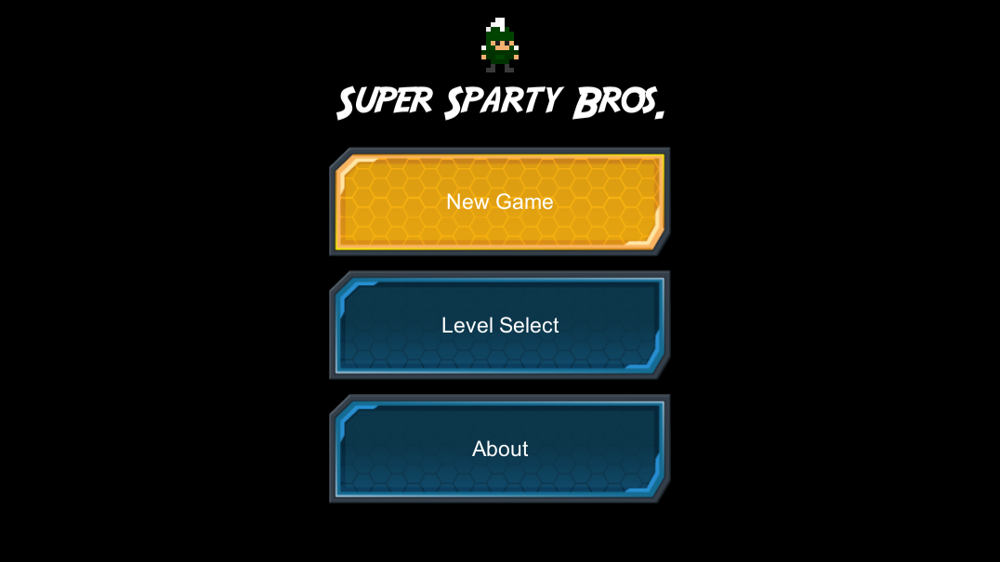
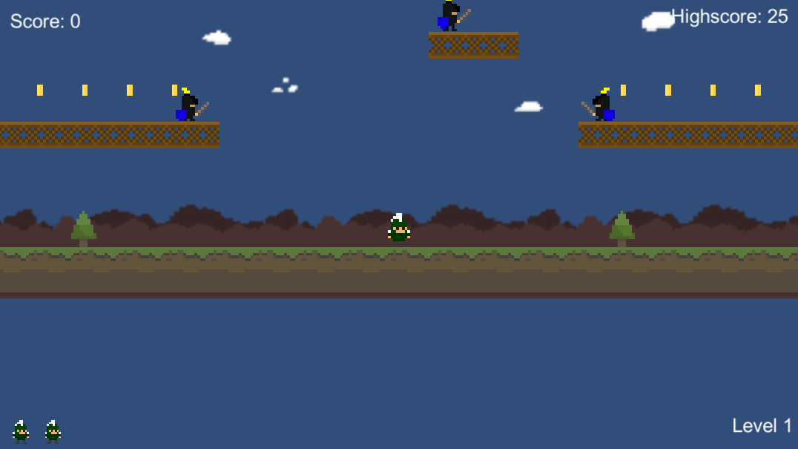
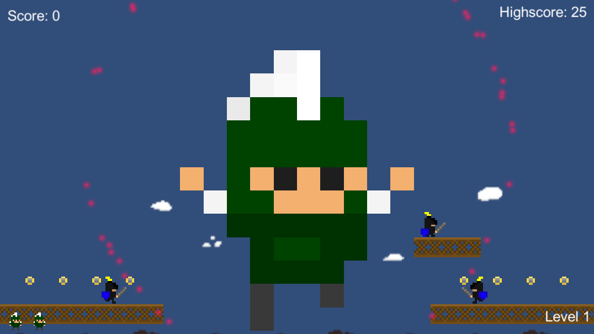
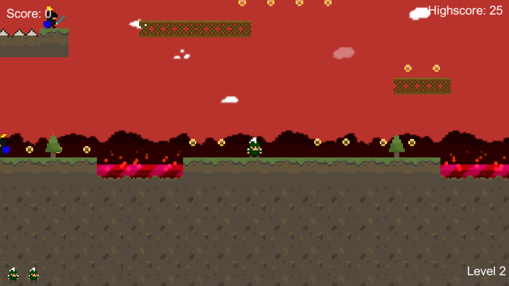
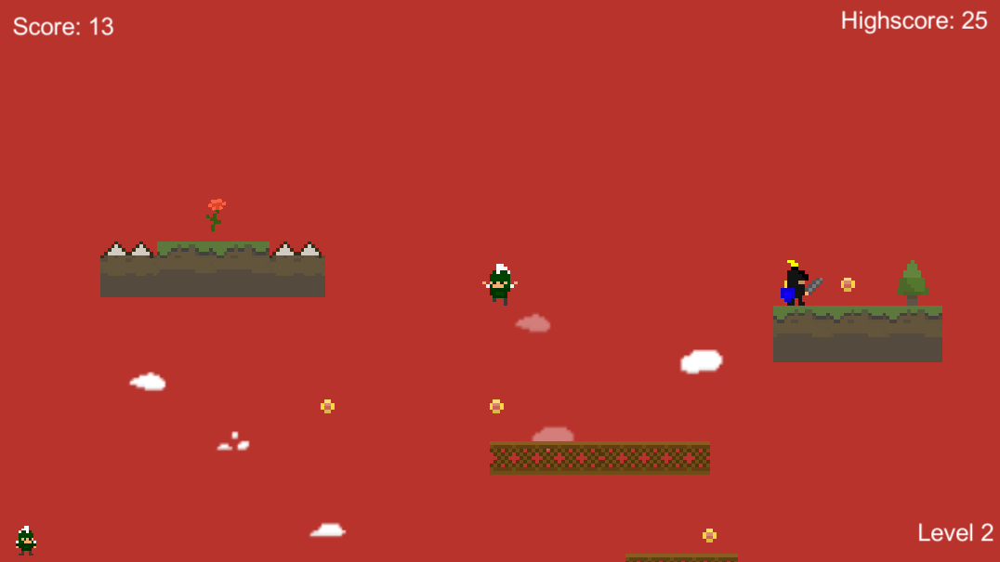

# Super Sparty Bros

> This project is an assignment of "[Game Development for Modern Platforms](https://www.coursera.org/learn/gamedev-platforms/)" course by [Coursera](https://www.coursera.org/).

- In this game Sparty(player) have to collect coins which increase the score and to beat the level sparty have to collect the Rose (victory element).
- Sparty can stun the enemy for sometime by jumping on the head of it.
- The Player can double jump to reach higher place.

## Video ( Click to Watch )

### Screenshots

